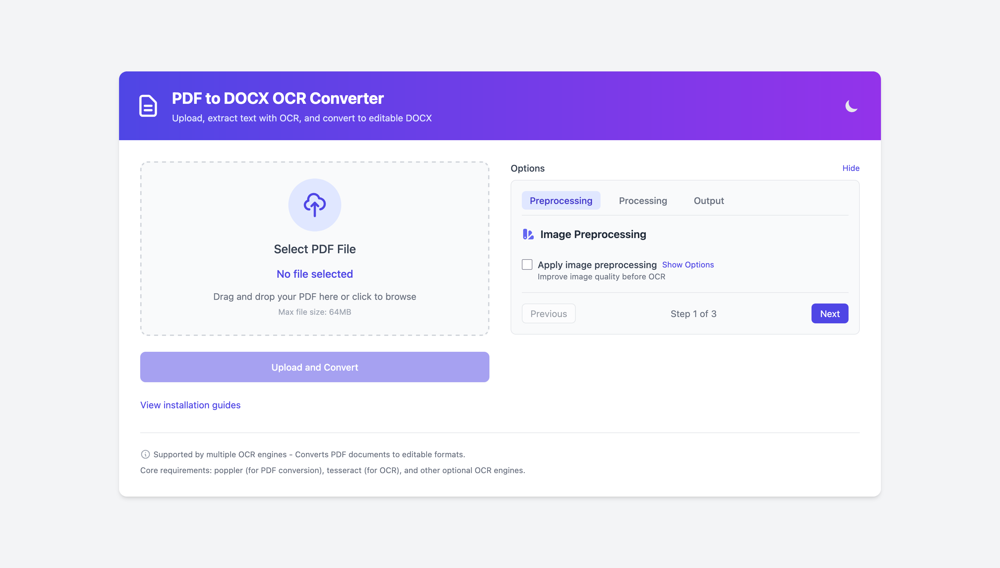
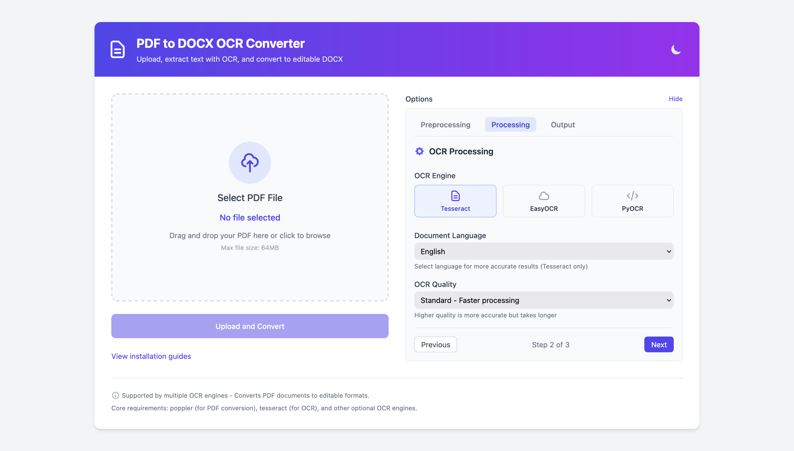
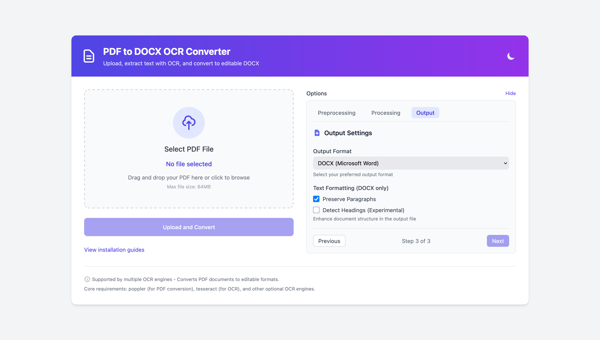
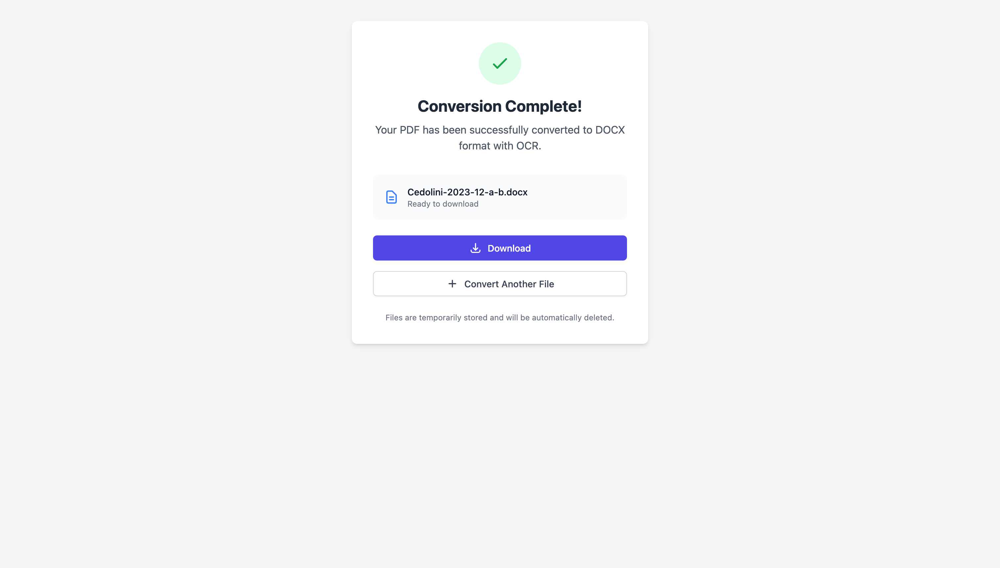

# PDF to DOCX/TXT/MD/HTML OCR Converter

[](https://www.python.org/downloads/)
[](https://opensource.org/licenses/MIT)
[](https://github.com/yourusername/ocr-pdf-docx)

A powerful web-based application built with Flask to convert PDF documents into editable formats (DOCX, TXT, Markdown, HTML) using Optical Character Recognition (OCR). It supports multiple OCR engines and provides advanced options for image preprocessing to improve accuracy.

## Screnshots







## Features

*   **Modern Web Interface:** 
    * Simple drag-and-drop or browse interface for uploading PDF files
    * Responsive design that works on desktop, tablet, and mobile devices
    * Dark mode support for comfortable usage in different lighting conditions
    * Real-time feedback during file upload and processing

*   **Multiple Output Formats:** Convert PDFs to:
    *   Microsoft Word (`.docx`) with formatting preservation
    *   Plain Text (`.txt`) for maximum compatibility
    *   Markdown (`.md`) for easy integration with documentation systems
    *   HTML (`.html`) for web publishing

*   **Multiple OCR Engines:** Choose between:
    *   **Tesseract:** (Default) Widely used, supports 100+ languages
    *   **EasyOCR:** Often better for complex layouts, handwriting, or noisy images
    *   **PyOCR:** A wrapper that can use Tesseract or Cuneiform backends

*   **Comprehensive Language Support:** 
    * Select from a wide range of document languages for better OCR accuracy
    * Multi-language detection support for documents containing multiple languages
    * Primary support for English, French, German, Spanish, Italian, Portuguese, Chinese, Japanese, Korean, Russian, Arabic, and Hindi

*   **Advanced Image Preprocessing:** Enhance image quality before OCR with options like:
    *   Grayscale conversion
    *   Sharpening
    *   Denoising
    *   Deskewing (straightening tilted text)
    *   Thresholding (creating high-contrast images)
    *   Border removal
    *   Contrast adjustment
    *   DPI selection (300 or 600 DPI)
    *   Preset profiles for common scenarios (text-heavy documents, scanned documents, low quality images, printed text, handwriting)

*   **Quality & Performance Settings:**
    * Choose between standard (faster) and high quality (slower, more accurate) OCR processing
    * Memory-efficient processing for large documents
    * Multi-threading support for faster processing when available

*   **Robust Processing System:**
    * Background processing with asynchronous task handling
    * Real-time progress tracking with estimated completion time
    * Cancellable operations with clean resource management
    * Auto-recovery from common processing errors

*   **Developer-Friendly:**
    * Comprehensive error logging with detailed diagnostics
    * Modular architecture allowing easy extension with new OCR engines
    * Clean API endpoints for potential integration with other systems
    * Docker support for easy deployment in any environment
    * Automated testing with colored output for better readability

*   **Advanced Features:**
    * Intelligent paragraph detection in output documents
    * Experimental heading detection for better document structure
    * Common OCR error correction using contextual text analysis
    * Resource management with automatic temporary file cleanup
    * Self-diagnostic dependency checker

## Installation

### Prerequisites

1.  **Python:** Version 3.7 or higher.
2.  **pip:** Python package installer (usually comes with Python).
3.  **Tesseract OCR Engine:**
    *   **macOS:** `brew install tesseract tesseract-lang`
    *   **Ubuntu/Debian:** `sudo apt-get update && sudo apt-get install tesseract-ocr libtesseract-dev tesseract-ocr-all` (Install desired language packs, e.g., `tesseract-ocr-fra`)
    *   **Windows:** Download installer from [UB Mannheim Tesseract Wiki](https://github.com/UB-Mannheim/tesseract/wiki). **Ensure Tesseract is added to your system's PATH.**
4.  **Poppler PDF Rendering Library:**
    *   **macOS:** `brew install poppler`
    *   **Ubuntu/Debian:** `sudo apt-get update && sudo apt-get install poppler-utils`
    *   **Windows:** Download latest binaries from [Poppler for Windows Releases](https://github.com/oschwartz10612/poppler-windows/releases/). Extract and add the `bin/` directory to your system's PATH.

### Using the Installer Script (Recommended)

The easiest way to install Python dependencies and check system prerequisites is using the provided script:

```bash
# Clone the repository (if you haven't already)
git clone https://github.com/fabriziosalmi/pdf-ocr.git
cd pdf-ocr

# Run the installer script
python install_dependencies.py

# To install optional OCR engines (EasyOCR, PyOCR):
# python install_dependencies.py --engine easyocr
# python install_dependencies.py --engine pyocr
# python install_dependencies.py --engine all
```

The script will:
*   Check your Python version.
*   Install core Python packages (`Flask`, `pytesseract`, `python-docx`, `pdf2image`, `Pillow`, etc.).
*   Check if Tesseract and Poppler are accessible via the system PATH.
*   Optionally install dependencies for EasyOCR and PyOCR.

### Manual Installation

1.  **Clone the repository:**
    ```bash
    git clone https://github.com/fabriziosalmi/pdf-ocr.git
    cd pdf-ocr
    ```

2.  **Install core Python dependencies:**
    ```bash
    pip install -r requirements.txt
    ```

3.  **(Optional) Install dependencies for other OCR engines:**
    ```bash
    # For EasyOCR (may require manual PyTorch installation first - see https://pytorch.org/)
    pip install -r requirements-easyocr.txt

    # For PyOCR
    pip install -r requirements-pyocr.txt
    ```

4.  **Verify System Dependencies:** Ensure Tesseract and Poppler are installed and accessible in your system's PATH.

### Docker Installation

For a containerized setup (no need to install Tesseract or Poppler locally):

1. **Build and run with Docker Compose:**
   ```bash
   docker-compose up -d
   ```

2. **Or build and run manually:**
   ```bash
   docker build -t ocr-pdf-docx .
   docker run -p 8011:8011 ocr-pdf-docx
   ```

The application will be available at `http://localhost:8011`.

## Usage

1.  **Start the Flask application:**
    ```bash
    python app.py
    ```
    The application will be available at `http://127.0.0.1:8011` (or the configured host/port).

2.  **Open the web interface:** Navigate to the URL in your web browser.

3.  **Upload PDF:** Drag and drop a PDF file onto the designated area or click to browse.

4.  **Configure Options (Optional):**
    *   Click the "Show" button next to "Options" to expand the settings panel.
    *   **Preprocessing:** Enable and configure image enhancement options or select a preset profile. Adjust DPI if needed.
    *   **Processing:** Select the desired OCR Engine (Tesseract, EasyOCR, PyOCR), Document Language (for Tesseract), and OCR Quality.
    *   **Output:** Choose the desired Output Format (DOCX, TXT, MD, HTML).

5.  **Convert:** Click the "Upload and Convert" button.

6.  **Monitor Progress:** You will be redirected to a status page showing the conversion progress with real-time updates.

7.  **Download:** Once complete, click the "Download" button on the success page.

8.  **Convert Another:** Click "Convert Another File" to return to the upload page.

## Configuration

The application can be configured using environment variables (e.g., in a `.env` file):

*   `FLASK_ENV`: Set to `development` for debug mode, `production` otherwise.
*   `SECRET_KEY`: A strong, random secret key for session management. If not set, a temporary one is generated.
*   `PORT`: The port the application runs on (default: `8011`).
*   `HOST`: The host to bind to (default: `0.0.0.0` in Docker, `127.0.0.1` otherwise).
*   `UPLOAD_FOLDER`: Directory for uploaded files (default: `uploads/`).
*   `MAX_CONTENT_LENGTH`: Maximum upload size in bytes (default: 64MB).
*   `CLEANUP_INTERVAL`: How often to run cleanup of old files in seconds (default: 3600).
*   `CLEANUP_THRESHOLD`: Age in seconds after which temporary files are deleted (default: 86400 - 1 day).
*   `DOCKER_ENV`: Set to `true` when running in Docker (automatically set in the Dockerfile).

Example `.env` file:
```
FLASK_ENV=production
SECRET_KEY=your_secret_key_here
PORT=8011
HOST=0.0.0.0
MAX_CONTENT_LENGTH=67108864
CLEANUP_INTERVAL=3600
CLEANUP_THRESHOLD=86400
```

## Advanced Usage

### Preprocessing Profiles

The application includes several preset profiles for different document types:

- **Default**: Basic grayscale and sharpening, moderate contrast
- **Text-heavy Document**: Enhanced settings for documents with dense text
- **Scanned Document**: Optimized for typical scanned pages
- **Low Quality Image**: Aggressive enhancement for poor quality scans
- **Printed Text**: Optimized for machine-printed text
- **Handwriting**: Adjusted for handwritten content

### OCR Engines Comparison

- **Tesseract**: Fastest option with good accuracy for clear, printed text. Best for most documents.
- **EasyOCR**: Better with complex layouts and handwriting, but slower. Good for challenging documents where Tesseract struggles.
- **PyOCR**: Provides a unified interface to different OCR backends. Useful for testing different engines.

### Batch Processing

For batch processing multiple PDFs, consider using the Docker setup with a shared volume:

```bash
docker run -p 8011:8011 -v /path/to/your/pdfs:/app/batch ocr-pdf-docx
```

## Troubleshooting

### Dependency Issues

#### Tesseract Not Found
- Ensure Tesseract is installed correctly for your operating system.
- Verify that the Tesseract installation directory is in your system's PATH environment variable.
- On Windows, you may need to explicitly set the Tesseract path in `app.py`:
  ```python
  pytesseract.pytesseract.tesseract_cmd = r'C:\Program Files\Tesseract-OCR\tesseract.exe'
  ```

#### Poppler / PDF Conversion Issues
- Ensure Poppler is installed and in your PATH.
- On Windows, check the installation directory and ensure it's properly added to the PATH.
- Restart your terminal/command prompt after making PATH changes.

#### OCR Engine-Specific Issues
- **EasyOCR**: Ensure PyTorch is installed correctly for your system (CPU or GPU version).
- **PyOCR**: Make sure Tesseract is installed as PyOCR relies on it.

### Common Errors

#### Empty or Incomplete OCR Results
- Try increasing the DPI settings to 600 DPI for better quality.
- Enable preprocessing options like sharpening and contrast adjustment.
- For low-quality scans, try using the "Low Quality Image" preset profile.
- Different OCR engines may produce better results for certain documents; try switching engines.

#### Performance Issues
- Processing large PDF files can be memory-intensive. Ensure your system has sufficient RAM.
- High-quality settings and certain preprocessing options significantly increase processing time.
- The first run with EasyOCR may be slow as it downloads language models.

## Recent Updates (April 2025)

- Added dark mode support for better usability in different lighting conditions
- Enhanced mobile responsiveness for better experience on smaller screens
- Improved preprocessing with additional options and preset profiles
- Added colored test output for easier development
- Fixed resource warnings in image processing pipeline
- Added real-time progress estimation with more accurate time remaining calculation
- Improved error handling and recovery mechanisms
- Enhanced documentation with more detailed installation and usage instructions

## Planned Features

- Integration with cloud storage services (Google Drive, Dropbox)
- PDF annotation detection and preservation
- Table structure recognition and preservation in output formats
- Specialized handling for scientific papers and forms
- API endpoints for programmatic access

## Contributing

Contributions are welcome! Please feel free to submit a Pull Request.

1. Fork the repository
2. Create your feature branch (`git checkout -b feature/amazing-feature`)
3. Commit your changes (`git commit -m 'Add some amazing feature'`)
4. Push to the branch (`git push origin feature/amazing-feature`)
5. Open a Pull Request

## License

This project is licensed under the MIT License - see the LICENSE file for details.

## Acknowledgments

- [Tesseract OCR](https://github.com/tesseract-ocr/tesseract) for the core OCR capability
- [EasyOCR](https://github.com/JaidedAI/EasyOCR) for the alternative OCR engine
- [PyOCR](https://gitlab.gnome.org/World/OpenPaperwork/pyocr) for the Tesseract/Cuneiform wrapper
- [Flask](https://flask.palletsprojects.com/) for the web framework
- [pdf2image](https://github.com/Belval/pdf2image) for PDF to image conversion
- [python-docx](https://python-docx.readthedocs.io/) for DOCX creation
- [Tailwind CSS](https://tailwindcss.com/) for the UI components
- [colorama](https://pypi.org/project/colorama/) for colored test output
